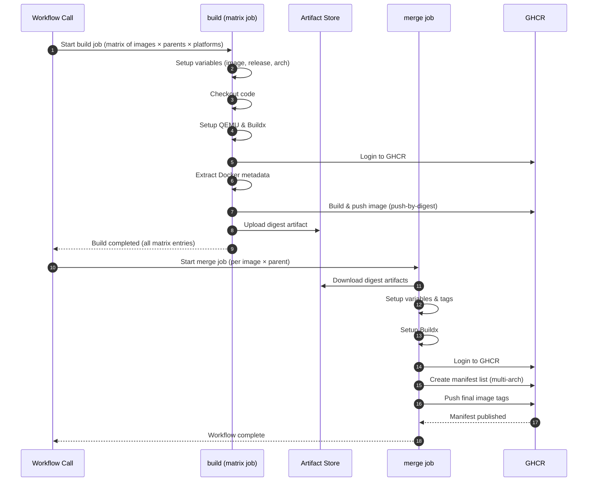

# CI Templates

Reusable GitHub Actions workflow templates for building, testing, and maintaining Docker images and code quality.

## Table of Contents

- [Overview](#overview)
- [Available Workflows](#available-workflows)
- [Usage in Other Repositories](#usage-in-other-repositories)
- [Configuration Files](#configuration-files)
- [Contributing](#contributing)
- [Code of Conduct](#code-of-conduct)
- [Security](#security)
- [License](#license)

## Overview

This repository contains a collection of reusable GitHub Actions workflows that can be used across multiple repositories to:

- Build and publish multi-platform Docker images to GitHub Container Registry (ghcr.io)
- Scan Docker images for security vulnerabilities
- Lint Docker images for best practices and CIS benchmarks
- Lint code bases for quality and standards
- Clean up unused Docker images and build caches
- Manage stale issues and pull requests

## Available Workflows

### [build-images.yml](.github/workflows/build-images.yml)

Builds and publishes multi-platform Docker images to ghcr.io with support for multiple base images, platforms, and custom tags.

**Features:**

- Multi-platform builds (linux/amd64, linux/arm64, etc.)
- Support for multiple base images (Ubuntu releases)
- GitHub Actions cache optimization
- Automatic tagging strategies (semver, branch, schedule)
- Push-by-digest for efficient multi-arch builds



### [scan-images.yml](.github/workflows/scan-images.yml)

Performs security vulnerability scanning on Docker images using Trivy.

**Features:**

- Scans for CRITICAL and HIGH severity vulnerabilities
- Generates SARIF reports
- Multi-platform image support

### [lint-images.yml](.github/workflows/lint-images.yml)

Lints Docker images for best practices and CIS benchmarks using Dockle.

**Features:**

- Best practices validation
- CIS benchmark compliance checks
- Multi-platform image support

### [lint-files.yml](.github/workflows/lint-files.yml)

Lints the entire codebase using Super-Linter.

**Features:**

- Multiple language support
- Dockerfile, YAML, JSON, Markdown validation
- Configurable via `.github/super-linter.env`


### [clean-packages.yml](.github/workflows/clean-packages.yml)

Removes untagged and unsupported Docker image versions from ghcr.io.

**Features:**

- Deletes untagged images
- Removes deprecated version tags
- Preserves supported releases


### [clean-cache.yml](.github/workflows/clean-cache.yml)

Deletes all GitHub Actions cache entries for a repository.

**Features:**

- Batch deletion of cache entries
- Useful for troubleshooting build issues


### [close-stale.yml](.github/workflows/close-stale.yml)

Automatically marks and closes stale issues and pull requests.

**Features:**

- Configurable staleness periods
- Customizable warning and closing messages
- Separate handling for issues and PRs

### [read-matrix.yml](.github/workflows/read-matrix.yml)

Reads build matrix configuration from a JSON file.

**Features:**

- Centralizes build configuration
- Outputs matrix values for use in other workflows

## Usage in Other Repositories

### Prerequisites

1. Enable GitHub Actions in your repository
2. For Docker image workflows, ensure GitHub Container Registry is enabled
3. Create a Personal Access Token (PAT) with `packages:write` and `repo` permissions for cleanup workflows

### Basic Example

Create a workflow file in your repository at `.github/workflows/build.yml`:

```yaml
name: Build Docker Images

on:
  push:
    branches: [main]
  pull_request:
    branches: [main]

jobs:
  # Read build matrix configuration
  setup:
    uses: rlaiola/ci-templates/.github/workflows/read-matrix.yml@main
    with:
      matrix-path: matrix.json

  # Build and publish images
  build:
    needs: setup
    uses: rlaiola/ci-templates/.github/workflows/build-images.yml@main
    with:
      images: ${{ needs.setup.outputs.release }}
      parents: ${{ needs.setup.outputs.parent }}
      default_parent: ${{ needs.setup.outputs.default_parent }}
      platforms: ${{ needs.setup.outputs.platform }}
      tags: 'latest'
      ref: ${{ github.ref }}

  # Lint images
  lint:
    needs: [setup, build]
    uses: rlaiola/ci-templates/.github/workflows/lint-images.yml@main
    with:
      images: ${{ needs.setup.outputs.release }}
      parents: ${{ needs.setup.outputs.parent }}
      platforms: ${{ needs.setup.outputs.platform }}
      tag: 'latest'

  # Scan images
  scan:
    needs: [setup, build]
    uses: rlaiola/ci-templates/.github/workflows/scan-images.yml@main
    with:
      images: ${{ needs.setup.outputs.release }}
      parents: ${{ needs.setup.outputs.parent }}
      platforms: ${{ needs.setup.outputs.platform }}
      tag: 'latest'
```

### Matrix Configuration File

Create a `matrix.json` file in your repository root:

```json
{
  "release": ["1.0.0", "1.1.0"],
  "parent": ["ubuntu:22.04", "ubuntu:24.04"],
  "platform": ["linux/amd64", "linux/arm64"],
  "repository": "https://github.com/yourusername/yourrepo.git",
  "ref": "main"
}
```

### Cleanup Workflows

For cleanup workflows, add a secret named `GH_TOKEN` to your repository with a PAT that has the required permissions:

```yaml
name: Cleanup

on:
  workflow_dispatch:
  schedule:
    - cron: '0 2 * * 0' # Weekly on Sunday at 2 AM

jobs:
  cleanup-packages:
    uses: rlaiola/ci-templates/.github/workflows/clean-packages.yml@main
    with:
      tags: 'dev test' # Additional tags to preserve
    secrets:
      GH_TOKEN: ${{ secrets.GH_TOKEN }}

  cleanup-cache:
    uses: rlaiola/ci-templates/.github/workflows/clean-cache.yml@main
    secrets:
      GH_TOKEN: ${{ secrets.GH_TOKEN }}
```

### Code Linting

```yaml
name: Lint Code

on:
  push:
    branches-ignore: [main]
  pull_request:
    branches: [main]

jobs:
  lint:
    uses: rlaiola/ci-templates/.github/workflows/lint-files.yml@main
```

### Stale Issue Management

```yaml
name: Manage Stale Issues

on:
  schedule:
    - cron: '30 18 * * *'

jobs:
  stale:
    uses: rlaiola/ci-templates/.github/workflows/close-stale.yml@main
    with:
      stale_issue_label: 'stale'
      days_before_stale: 90
      days_before_close: 7
```

## Configuration Files

- `.github/super-linter.env` - Super-Linter configuration
- `.yamllint` - YAML linting rules
- `markdownlint-cli2.jsonc` - Markdown linting configuration
- `.prettierrc` - Code formatting rules

## Contributing

If you would like to help contribute to this project, please see [CONTRIBUTING.md](https://github.com/rlaiola/ci-templates/blob/main/CONTRIBUTING.md).

Before submitting a PR consider building and testing a Docker image locally and checking your code with Super-Linter:

```sh
docker run --rm \
           -e ACTIONS_RUNNER_DEBUG=true \
           -e RUN_LOCAL=true \
           -e DEFAULT_BRANCH=main \
           --env-file ".github/super-linter.env" \
           -v "$PWD":/tmp/lint \
           ghcr.io/super-linter/super-linter:latest
```

## Code of Conduct

See [CODE_OF_CONDUCT.md](https://github.com/rlaiola/ci-templates/blob/main/CODE_OF_CONDUCT.md) for community standards.

## Security

See [SECURITY.md](https://github.com/rlaiola/ci-templates/blob/main/SECURITY.md) for security policy and vulnerability reporting.

## License

Copyright Universidade Federal do Espirito Santo (Ufes)

This program is free software: you can redistribute it and/or modify
it under the terms of the GNU General Public License as published by
the Free Software Foundation, either version 3 of the License, or
(at your option) any later version.

This program is distributed in the hope that it will be useful,
but WITHOUT ANY WARRANTY; without even the implied warranty of
MERCHANTABILITY or FITNESS FOR A PARTICULAR PURPOSE. See the
GNU General Public License for more details.

You should have received a copy of the GNU General Public License
along with this program. If not, see <https://www.gnu.org/licenses/>.

This program is released under license GNU GPL v3+ license.
